Quando o SAP calcula precos (pricing) e encontra uma **condition type com Formula 279**, o TXS e acionado. O fluxo executa em 8 fases sequenciais.

---

## Diagrama do Fluxo

```mermaid
flowchart TB
    PRICING["Pricing SAP<br/>(Formula 279)"]

    F1["<b>FASE 1</b> — Entrada e Validacoes<br/><br/>CL_TXS_CONTROLLER<br/>CL_TXS_SWITCH::is_active()"]

    F2{"<b>FASE 2</b> — Decisao<br/><br/>Service Call?<br/>(1a condition)"}

    F3["<b>FASE 3</b> — Build Payload (JSON)<br/><br/>Header + Items + Locations + Party<br/>NCM, CNPJ, IE, CNAE, CFOP"]

    BADI_R["<b>BAdI RELEASED</b><br/>BD_GSLOG_EXT_TAX_CALC_PAYLOAD<br/>extend_payload()<br/><i>(seguro para Public Cloud)</i>"]

    F4["<b>FASE 4</b> — HTTP POST<br/><br/>OAuth2 + JSON camelCase<br/>X-CorrelationID (UUID)"]

    ENGINE["<b>Motor de Calculo Externo</b><br/><br/>Sovos | Vertex |<br/>Thomson Reuters"]

    F5["<b>FASE 5</b> — Processar Resposta<br/><br/>tax_lines[] → tax_values[]<br/>ICMS, IPI, PIS, COFINS..."]

    BUFFER[("<b>Response Buffer</b><br/>(Singleton)<br/>1 HTTP → N leituras")]

    F6["<b>FASE 6</b> — Mapear para KOMV<br/><br/>ICMS→BX16/ICM1  IPI→BIP0/IPI1<br/>PIS→BPI1/IPIS  COFINS→BCO1/ICOF<br/><br/>KWERT = valor<br/>KBETR = taxa × 10<br/>KAWRT = base"]

    F7{"<b>FASE 7</b> — Verificacao<br/><br/>Pelo menos 1<br/>condition OK?"}

    F8["<b>FASE 8</b> — Pos-Processamento<br/><br/>Error handling, Log SLG1<br/>Reset KOMP"]

    BADI_NR["<b>BAdI NAO Released</b><br/>TXS_BADI_CONTROLLER<br/>pre/post_processing<br/>calculate_taxes<br/><i>(risco em upgrades)</i>"]

    RESULTADO["Pricing SAP<br/>KOMV preenchida com impostos"]

    ERRO["ERRO<br/>mapping_condition_error"]

    PRICING --> F1
    F1 --> F2

    F2 -->|"SIM (TXSC)"| F3
    F2 -->|"NAO (BX16, BIP0...)"| BUFFER

    F3 --> BADI_R
    BADI_R --> F4
    F4 --> ENGINE
    ENGINE --> F5
    F5 --> BUFFER

    BUFFER --> F6
    F6 --> F7

    F7 -->|"SIM"| F8
    F7 -->|"NAO (KINAK=X)"| ERRO

    F8 --> RESULTADO

    BADI_NR -.->|"pre_processing"| F1
    BADI_NR -.->|"calculate_taxes"| F4
    BADI_NR -.->|"post_processing"| F8

    classDef fase fill:#E3F2FD,color:#1565C0,stroke:#1565C0,stroke-width:2px
    classDef released fill:#C8E6C9,color:#2E7D32,stroke:#2E7D32,stroke-width:2px
    classDef notReleased fill:#FFE0B2,color:#E65100,stroke:#E65100,stroke-width:2px
    classDef external fill:#BBDEFB,color:#0D47A1,stroke:#0D47A1,stroke-width:2px
    classDef decision fill:#F3E5F5,color:#6A1B9A,stroke:#6A1B9A,stroke-width:2px
    classDef bufferNode fill:#FFF9C4,color:#F57F17,stroke:#F57F17,stroke-width:2px
    classDef error fill:#FFCDD2,color:#B71C1C,stroke:#B71C1C,stroke-width:2px
    classDef result fill:#DCEDC8,color:#33691E,stroke:#33691E,stroke-width:2px

    class F1,F3,F4,F5,F6,F8 fase
    class BADI_R released
    class BADI_NR notReleased
    class ENGINE external
    class F2,F7 decision
    class BUFFER bufferNode
    class ERRO error
    class PRICING,RESULTADO result
```

---

## Detalhamento por Fase

### Fase 1 — Entrada e Validacoes

- Recebe `KOMK`/`KOMP`/`KOMV` do pricing
- Enriquece com dados fiscais (LFD: CNPJ, IE, CFOP, NCM)
- Valida se TXS esta ativo (`CL_TXS_SWITCH::IS_ACTIVE`)
- Cria objeto de contexto

**Classe principal**: `CL_TXS_CNDNS_HANDLE_BR`

### Fase 2 — Decisao

- E a condition de "service call" (`TXSC`)?
  - **SIM** → vai para Fase 3 (HTTP call)
  - **NAO** → vai para Fase 6 (mapeia do buffer)

### Fase 3 — Build do Payload

- Monta JSON com: header, items, locations, parties
- Inclui: NCM, CEST, CNPJ, IE, CNAE, CFOP, contribuinte
- BAdI Released pode modificar o payload aqui

**Classe principal**: `CL_TXS_PAYLOAD_BR`

### Fase 4 — Comunicacao HTTP

- Autentica via OAuth2 (Client Credentials)
- Serializa payload para JSON (camelCase)
- POST para o motor externo
- Recebe resposta JSON

**Classe principal**: `CL_TXS_COMMUNICATION`
**Communication Scenario**: `SAP_COM_0249`

### Fase 5 — Processamento da Resposta

- Desserializa JSON de volta para estrutura ABAP
- Separa por tipo de imposto (ICMS, IPI, PIS, COFINS...)
- Armazena no Response Buffer (cache singleton)

**Classe principal**: `CL_TXS_RESPONSE_BR`

### Fase 6 — Mapeamento para KOMV

- Mapeia tax_type → condition types (ex: ICMS → BX16/ICM1/BX10...)
- Preenche `KWERT` (valor), `KBETR` (taxa), `KAWRT` (base)
- Mapeia tax code externo → tax code S/4 (via tabela)

**Classe principal**: `CL_TXS_CONDITIONS_MAPPER_BR`

### Fase 7 — Verificacao

- Pelo menos 1 condition foi mapeada com sucesso?
- Se nenhuma: erro `mapping_condition_error`

**Classe principal**: `CL_TXS_CNDNS_EXCEPTIONS_HANDLE_BR`

### Fase 8 — Pos-Processamento

- Error handling (se houve erro)
- Gravacao de dados fiscais locais (LFD)
- Limpa dados temporarios, retorna ao pricing

**Classe principal**: `GSLOG_LOCAL_FISCAL_DATA`

---

## Antes (On-Premise) vs Agora (Cloud)

| Aspecto | On-Premise | S/4HANA Cloud |
|---------|-----------|---------------|
| Tax Procedure | TAXBRA / TAXBRAJ | TAXBRAJ (adaptado) |
| Determinacao | Condition records manuais (FTXP, OBYZ) | Motor externo (Sovos) |
| Calculo | Formulas internas do pricing | HTTP call para Sovos |
| Manutencao de taxas | Consultor atualiza condition records | Equipe fiscal atualiza no Sovos |
| Compliance | Responsabilidade do cliente | Compartilhada com parceiro fiscal |

---

## Navegacao

<Columns cols={2}>
  <Card title="Payload Reference" icon="file-text" href="/txs/payload/header">
    Detalhes de cada estrutura do payload
  </Card>
  <Card title="Pipeline por Fase" icon="arrow-right" href="/txs/pipeline/request">
    Documentacao detalhada de cada fase
  </Card>
  <Card title="Troubleshooting" icon="alert-triangle" href="/txs/reference/troubleshooting">
    10 cenarios de problema com solucoes
  </Card>
  <Card title="Debug Cheat Sheet" icon="clipboard" href="/txs/reference/cheatsheet-debug">
    Classes e metodos para debug rapido
  </Card>
</Columns>
